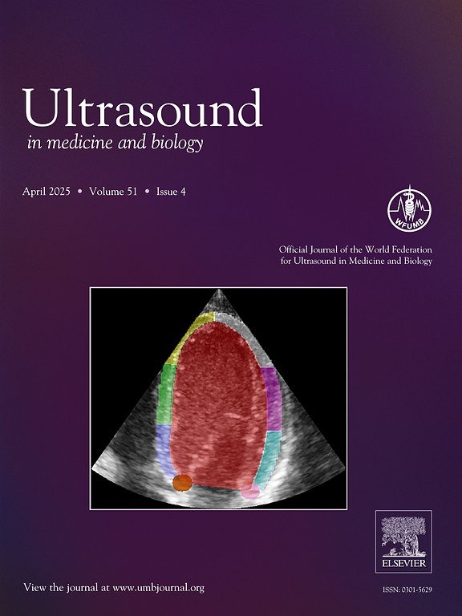

# Regional Image Quality Scoring for 2-D Echocardiography Using Deep Learning


## Publication & Citation
You should cite the following paper when using the code in this repository:

Van De Vyver, Gilles, et al. "Regional Image Quality Scoring for 2-D Echocardiography Using Deep Learning." Ultrasound in Medicine & Biology (2025). https://www.sciencedirect.com/science/article/pii/S0301562924004691

Blog post: [https://gillesvandevyver.com/#/projects/finding-hearts](https://gillesvandevyver.com/#/projects/finding-hearts)


## Toturial
Jupyter notebook toturials are available at

- End to end quality prediction: [tutorial/tutorial_end_to_end_quality_prediction.ipynb](tutorial/tutorial_end_to_end_quality_prediction.ipynb).

- Combine gCNR with segmentation: [tutorial/tutorial_gcnr.ipynb](tutorial/tutorial_gcnr.ipynb)

## Installation
The package can be installed using pip from github:
```bash
pip install git+https://github.com/GillesVanDeVyver/arqee.git
```
Alternatively, you can download the source code and install it using pip:
```bash
pip install .
```

## Main features

- Calculate quality per myocardial region for apical views via end to end (black-box) model
- Get quality measure based on gCNR per myocardial region for apical views


## Awards

The paper is on the cover page of its issue in the Ultrasound in Medicine & Biology (UMB) journal.




The work was presented at the 
MICCAI (Medical Image Computing and Computer Assisted Intervention) 2024 conference as a poster,
where it was awarded the runner-up prize for best poster in the
ASMUS (Advances in Simplifying Medical Ultrasound) workshop.


## Contact

Developer: <br />
[https://gillesvandevyver.com/](https://gillesvandevyver.com/)


Management: <br />
lasse.lovstakken@ntnu.no <br />
erik.smistad@ntnu.no <br />


The package has been developed using python 3.10.
